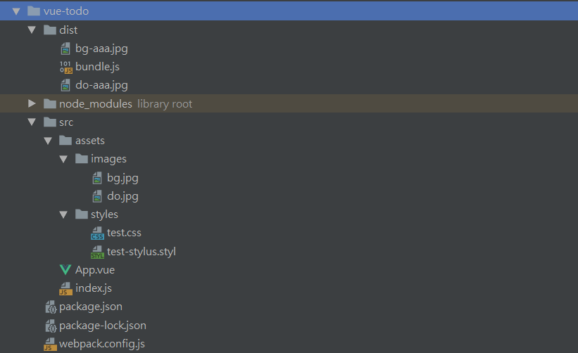

`webpack+vue`配置，已完成`webpack`和`webpack-dev-server`基本配置，可在此基础上添加业务逻辑。

下载：
```cmd
git clone https://github.com/mandyshen97/vue-webpack.git
```
安装依赖：
```$xslt
npm install
```
运行：
```cmd
npm run dev
```
<hr/>
<hr/>

# `vue+webpack`项目工程配置
## 创建`webpack`项目

### 项目初始化

- 进入项目文件夹，在终端

```cmd
npm init
```

生成 `package.json`

- 安装包和依赖

```cmd
npm install webpack vue vue-loader
```

- 安装后会出现一些提醒，根据提醒把需要的依赖装上去

```cmd
npm i css-loader vue-template-compiler 
```

此时项目就初始化好了。

## `webpack`项目配置

### 编写简单组件

- 建立文件夹 `src` ，文件夹`src/assets`，文件`src/App.vue`，入口文件`src/index.js`

在`App.vue`中写如下简单组件代码：

```javascript
// App.vue

<template>
  <div id="test">{{text}}</div>
</template>

<script>
export default {
  data() {
    return {
      text: 'abcd'
    }
  }
}
</script>

<style>
  #test {
    color: red;
  }
</style>
```

显然这个组件是无法在浏览器中直接运行的，下面的操作使它可以运行。

- 在`index.js`中将`App`组件挂载到`dom`节点中。

```javascript
// index.js

/**
 * 入口文件
 */
import Vue from 'vue';
import App from './App.vue';

const root = document.createElement('div');
document.body.appendChild(root);

// 创建Vue对象，将App组件挂载到root节点
new Vue({
  render: (h) => h(App)
}).$mount(root)
```

> `webpack`是帮我们打包前端资源的，我们的前端资源有很多类型，比如说`javascript` , `css `,`images`，字体等，这些都是要通过`http`请求去加载的内容。

- 在 `package.json`同级位置建立`webpack.config.js`文件。

```javascript
// webpack.config.js

// path是nodejs中的一个基本包，用来处理路径的
const path = require('path');
const VueLoaderPlugin = require('vue-loader/lib/plugin');

module.exports = {
  // 声明入口,entry使用绝对路径，保证不出错误
  entry: path.join(__dirname, 'src/index.js'),
  mode: 'production',
  // 出口
  output: {
    // 输出打包文件名（将index.js以及其依赖的资源打包成bundle.js）
    filename: 'bundle.js',
    // 输出路径
    path: path.join(__dirname, 'dist')
  },
  module: {
    rules: [
      {
        test: /.vue$/,
        loader: 'vue-loader'
      },
      {
        test: /.css$/,
        loader:['css-loader']
      }
    ]
  },
  plugins: [
    new VueLoaderPlugin()
  ]
}
```

- 在`package.json`中添加`build`:

> 只有在这里调用这个`webpack`，才会调用我们安装在项目里面的`webpack`，如果不在这里添加，直接在命令行里面输，则使用的是全局的`webpack`，版本可能不一样，应该在这里添加。

```json
// package.json

"scripts": {
    "test": "echo \"Error: no test specified\" && exit 1",
+   "build": "webpack --config webpack.config.js"
  },
```

- 运行

```cmd
npm run build
```

此时在项目文件夹下生成`dist`文件夹及`dist/bundle.js`

### 一些`loader`配置

- 在 `webpack.config.js`中添加下列内容：

```javascript
module: {
    rules: [
      {
        test: /\.vue$/,
        loader: 'vue-loader'
      },
      {
        test: /\.css$/,
        use: [
          'style-loader',
          'css-loader'
        ]
      },
      {
        test: /\.(gif|jpg|jpeg|png|svg)$/,
        use: [
          {
            loader:  'url-loader',
            options: {
              limit: 1024,
              name: '[name]-aaa.[ext]'
            }
          }
        ]
      }
    ]
  }
```

安装上面对应的`loader`

```cmd
npm i style-loader url-loader file-loader
```

- 在 `assets`文件夹中创建`assets/images`,`assets/styles`

- 在 `styles`下创建`test.css`

```css
body{
     color: red;
     background-image: url('../images/do.jpg');
 }
```

- 在`index.js`中`import`这个`test.css`和图片文件

```javascript
// index.js

import './assets/styles/test.css';
import './assets/images/bg.jpg';
```

- 执行

```cmd
npm run build
```

可以看到图片被打包到了`dist文件夹下`。`bundle.js`中也有了`test.css`的内容.

- 在 `webpack.config.js`的module模块的rules中添加css预处理器的规则。

```javascript
{
  test: /\.styl/,
  use: [
  	'style-loader',
  	'css-loader',
  	'stylus-loader'
	]
}
```

```cmd
npm i stylus-loader stylus
```

- 在 `styles`目录下新建`test-stylus.styl`文件

```stylus
// test-stylus.styl

body
  font-size 20px
```

- 在 `index.js`中引入`test-stylus.styl`

```javascript
import './assets/styles/test-stylus.styl';
```

- 运行

```cmd
npm run build
```

此时项目的目录结构如下：


## 配置`webpack-dev-server`

- `webpack-dev-server`是一个`webpack`的包，功能非常强大，可以去`webpack`官网<https://webpack.docschina.org/configuration/>查看详细配置。首先安装：

```cmd
npm i webpack-dev-server
```

- 在`package.json`中添加"dev"

```json
"scripts": {
    "test": "echo \"Error: no test specified\" && exit 1",
    "build": "webpack --config webpack.config.js",
+   "dev": "webpack-dev-server --config webpack.config.js"
  },
```

修改`webpack.config.js`的配置来适应`webpack-dev-server`的开发模式。

```javascript
module.exports = {
  // 编译目标是web平台
+ target: 'web',
```

因为在不同的平台上设置环境变量的方式是不一样的，使用`cross-env`来在不同的环境下使用同样的脚本。

```cmd
npm i cross-env
```

修改`package.json`

```json
"scripts": {
    "test": "echo \"Error: no test specified\" && exit 1",
-   "build": "webpack --config webpack.config.js",
+   "build": "cross-env NODE_ENV=production webpack --config webpack.config.js",
-   "dev": "webpack-dev-server --config webpack.config.js",
+   "dev": "cross-env NODE_ENV=development webpack-dev-server --config webpack.config.js"
  },
```

在`webpack.config.js`中判断：

```javascript
// webpack.config.js
// path是nodejs中的一个基本包，用来处理路径的
const path = require('path');
const VueLoaderPlugin = require('vue-loader/lib/plugin');

- module.exports = {
+ const isDev = process.env.NODE_ENV === 'development';

+ const config = {
  ...
}

+ if(isDev){
+  config.devServer = {
    // 端口
    port: 8080,
    // 主机
    host: '0.0.0.0',
    // 使webpack错误显示到页面上
    overlay: {
      error: true,
    }
  }
}


```

- 添加`html`文件使项目在浏览器中能打开。
- 添加`html`插件

```cmd
npm i html-webpack-plugin
```

配置插件：

```javascript
+ const HTMLPlugin = require('html-webpack-plugin');

plugins: [
+   new webpack.DefinePlugin({
      'process.env': {
        NODE_ENV: isDev ? '"development"' : '"production"'
      }
    }),
    new VueLoaderPlugin(),
+   new HTMLPlugin()
  ]
```

运行： 

```cmd
npm run dev
```

在浏览器中访问：<http://127.0.0.1:8080/>或<http://localhost:8080/>

此时改变页面内容，**保存**，浏览器的显示可以自动刷新！！

- 添加热替换和`devtool`

```javascript
// 如果是开发模式，则进行下列配置
if(isDev){
  // 控制是否生成，以及如何生成 source map
+ config.devtool = '#cheap-module-eval-source-map';
  config.devServer = {
    // 端口
    port: 8080,
    // 主机
    host: '0.0.0.0',
    // 使webpack错误显示到页面上
    overlay: {
      error: true,
    },
    // 自动打开浏览器
    // open: true,
    // 模块热替换，只更新更改的部分
+   hot: true
  };
  // 添加插件
+ config.plugins.push(
    // 热模块替换插件
    new webpack.HotModuleReplacementPlugin(),
    new webpack.NoEmitOnErrorsPlugin()
  );
}
```

- 重启

```cmd
npm run dev
```

改变内容，页面局部刷新。

### 配置完成

此时的文件内容：

```javascript
// webpack.config.js

// path是nodejs中的一个基本包，用来处理路径的
const path = require('path');
const VueLoaderPlugin = require('vue-loader/lib/plugin');
const HTMLPlugin = require('html-webpack-plugin');
const webpack = require('webpack');

const isDev = process.env.NODE_ENV === 'development';

const config = {
  // 编译目标是web平台
  target: 'web',
  // 声明入口,entry使用绝对路径，保证不出错误
  entry: path.join(__dirname, 'src/index.js'),
  mode: 'production',
  // 出口
  output: {
    // 输出打包文件名（将index.js以及其依赖的资源打包成bundle.js）
    filename: 'bundle.js',
    // 输出路径
    path: path.join(__dirname, 'dist')
  },
  module: {
    rules: [
      {
        test: /\.vue$/,
        loader: 'vue-loader'
      },
      {
        test: /\.css$/,
        use: [
          'style-loader',
          'css-loader'
        ]
      },
      {
        test: /\.(gif|jpg|jpeg|png|svg)$/,
        use: [
          {
            loader:  'url-loader',
            options: {
              limit: 1024,
              name: '[name]-aaa.[ext]'
            }
          }
        ]
      },
      {
        test: /\.styl/,
        use: [
          'style-loader',
          'css-loader',
          'stylus-loader'
        ]
      }
    ]
  },
  plugins: [
    new webpack.DefinePlugin({
      'process.env': {
        NODE_ENV: isDev ? '"development"' : '"production"'
      }
    }),
    new VueLoaderPlugin(),
    new HTMLPlugin()
  ]
}

// 如果是开发模式，则进行下列配置
if(isDev){
  // 控制是否生成，以及如何生成 source map
  config.devtool = '#cheap-module-eval-source-map';
  config.devServer = {
    // 端口
    port: 8080,
    // 主机
    host: '0.0.0.0',
    // 使webpack错误显示到页面上
    overlay: {
      error: true,
    },
    // 自动打开浏览器
    // open: true,
    // 模块热替换，只更新更改的部分
    hot: true
  };
  // 添加插件
  config.plugins.push(
    // 热模块替换插件
    new webpack.HotModuleReplacementPlugin(),
    new webpack.NoEmitOnErrorsPlugin()
  );
}

module.exports = config;
```

此时的文件内容：

```json
// package.json

{
  "name": "vue-todo",
  "version": "1.0.0",
  "description": "",
  "main": "index.js",
  "scripts": {
    "test": "echo \"Error: no test specified\" && exit 1",
    "build": "cross-env NODE_ENV=production webpack --config webpack.config.js",
    "dev": "cross-env NODE_ENV=development webpack-dev-server --config webpack.config.js"
  },
  "author": "",
  "license": "ISC",
  "dependencies": {
    "cross-env": "^5.2.0",
    "css-loader": "^2.1.1",
    "file-loader": "^3.0.1",
    "html-webpack-plugin": "^3.2.0",
    "style-loader": "^0.23.1",
    "stylus": "^0.54.5",
    "stylus-loader": "^3.0.2",
    "url-loader": "^1.1.2",
    "vue": "^2.6.10",
    "vue-loader": "^15.7.0",
    "vue-template-compiler": "^2.6.10",
    "webpack": "^4.32.2",
    "webpack-dev-server": "^3.5.1"
  },
  "devDependencies": {
    "webpack-cli": "^3.3.2"
  }
}
```
到此时为止，项目配置基本完成，之后写业务逻辑。
